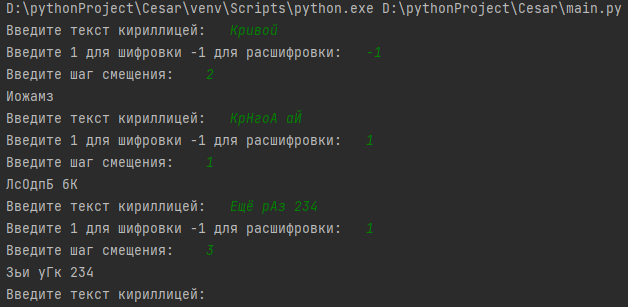

# Автор программы
Лада Александр Фт-220007
# Описание программы
Программа шифрует и расшифровывает текст шифром Цезаря
# Запуск
Программа может запускаться в любой удобной среде программирования для Python
____
*Пользователь вводит:* 
- текст
- 1/-1(Шифровка/Расшифровка)
- шаг смещения
# Тесты
Тест программы в VScode
___

